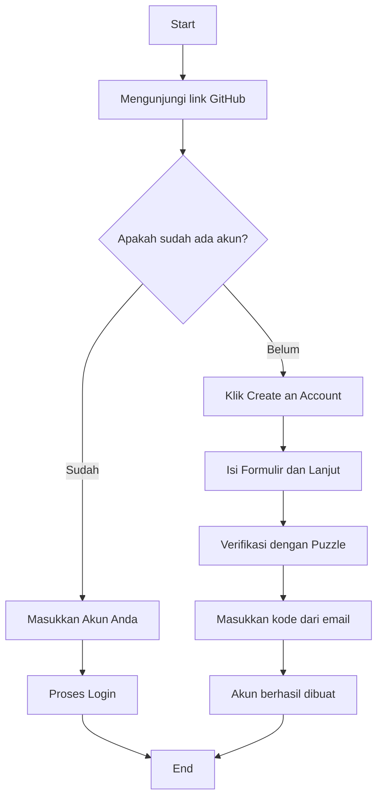

# **RANGKUMAN MATERI 🚀**
- Pada halaman ini akan berisi rangkuman mencakup semua materi yang sudah dijelaskan pada minggu pertama pembelajaran DevLand Batch 7 yaitu :

### ***1. Memulai Proyek dengan Akun Github***
[](https://github.com/nicolarieska)

- Github merupakan sebuah platform yang memungkinkan untuk mengelola semua proyek dalam pengembangan sistem informasi perangkat lunak. Dalam github, 
kita dapat menyimpan, merubah dan melihat perubahan hingga berkolaborasi antar tim pengembang. Sebelum dapat menggunakan github, hal pertama dan paling penting adalah membuat akun github. Berikut cara untuk 
membuat akun github yang digambarkan dengan flowchart dibawah ini : 

### ***2. Berkenalan dengan Frontend dan Backend***


[](https://document360.com/blog/api-documentation/600x300)

- **Frontend dan Backend** adalah bagian dari Sistem dan memiliki tugas yang berbeda beda. Ketika membicarakan Frontend maka didalamnya akan membahas seputar aktivitas yang berkaitan dengan Tampilan dan Interaksi Pengguna. Sedangkan
  Backend adalah aktivitas yang berkaitan dengan Logika, Koneksi Database, dan Server.
- **Frontend dan Backend** disini dapat saling berkomunikasi layaknya manusia dengan menggunakan yang namanya API (Application Programming Interface). Frontend akan melakukan permintaan data ke backend dan backend akan menerima serta memproses permintaan tersebut.
  Backend akan mengecek apakah permintaan tersebut bisa diterima dan ada dalam database. Jika memang permintaan tersebut diterima dan ada dalam database, maka backend akan mengirimkan respon berupa data dan pesan yang nantinya akan diterima kembali
  oleh frontend untuk ditampilkan. Perbedaan lainnya terdapat pada tabel dibawah ini :

<div align="center">

|                                                        | **Front End**                         | **Back End**                                      |
|:------------------------------------------------------:|:-------------------------------------:|:-------------------------------------------------:|
| **Tugas dan Tanggung Jawab**                           | Tampilan dan Interaksi Pengguna       | Logika, Koneksi Database, dan Server              |
| **Teknologi yang dipakai**                             | HTML, CSS, dan Javascript             | Node.JS, Python (Django/Flask), dan Java          |
| **Tools dan Framework**                                | React, Vue, dan Angular               | Spring Boot, Express.JS, Django, dan Flask        |

</div>


### ***3. Manajemen Proyek dengan Agile Scrum***
<p align="center">
  
</p>

- Agile Scrum adalah salah satu metode pengembangan perangkat lunak yang sering digunakan oleh sebagian besar perusahaan. Dimana metode ini fleksibel terhadap perubahan karena didalamnya terjadi perulangan aktivitas yang dilakukan hingga benar benar sesuai dengan requirements yang didapat.
  Metode ini mengandalkan komunikasi dan kolaborasi yang baik agar dapat mengimplementasikan metode ini dengan baik. Dan berikut adalah aktivitas yang ada didalam Agile Scrum yaitu : <br>
  <p style="margin-left: 20px;"><strong>a. Backlog atau Sprint Grooming</strong><br> Tahapan awal dari Agile Scrum yang dimana berisi perencanaan awal yang harus dilakukan untuk menentukan fitur apa saja didalam suatu aplikasi atau sistem yang akan dikembangkan </p>
  <p style="margin-left: 20px;"><strong>b. Sprint Planning</strong><br> Pada tahapan ini setelah dilakukan perincian fitur dalam aplikasi, Selanjutnya akan ditentukan siapa yang mengerjakan apa. Jadi setiap engineer akan mendapat task masing masing yang disesuaikan dengan kemampuannya. </p>
  <p style="margin-left: 20px;"><strong>c. Sprint</strong><br> Sprint adalah tahapan utama dari Agile Scrum, Tahapan ini adalah dimulainya pengembangan sistem atau yang biasa disebut dengan coding. Selama fase ini juga akan terjadi daily scrum meeting di setiap harinya untuk membahas apa yang sudah dikerjakan, apa target kedepan dan kendala yang dihadapi </p>
  <p style="margin-left: 20px;"><strong>d. Sprint Review</strong><br> Setelah sprint berhasil dilakukan, maka tahapan selanjutnya adalah Sprint Review. Sprint Review ini adalah aktivitas untuk melihat hasil yang telah dilakukan dan penentuan apakah perlu ada perbaikan atau tidak </p>
  <p style="margin-left: 20px;"><strong>e. Sprint Retrospective</strong><br> Dan tahapan terakhir dalam Agile Scrum adalah Sprint Retrospective. Tahapan ini dilakukan untuk membahas secara keseluruhan rangkaian pengembangan yang sudah dilakukan untuk melihat kendala yang dihadapi dan meminimalisir kesalahan yang sama di sprint berikutnya serta ada apresiasi bagi rekan yang yang bekerja baik pada sprint sebelumnya.</p>
  
### ***4. Source Code Manajemen (GIT)***
<p align="center">
  
</p>

- GIT adalah tools yang sering digunakan oleh developer atau pengembang perangkat lunak. Dimana didalam GIT ini memungkinkan developer untuk berkolaborasi, mengelola kode yang ditulis seperti mengecek perubahan dan melihat penambahan yang dilakukan oleh orang lain atau diri kita sendiri.
  GIT memiliki operasi yang dapat kita gunakan untuk melakukan suatu aksi didalam branch. Branch sendiri merupakan cabang yang memungkinkan pengguna melakukan perubahan tanpa menyentuh lingkungan pengembangan utama. Dan berikut adalah oeprasi yang sering digunakan beserta penjelasannya :

**1. Clone**
```bash
  git clone https://link-to-project
```
&emsp;&emsp;Clone dalam git memungkinkan pengguna untuk menyalin semua isi repositori yang dikehendaki dan ditempatkan di lokal <br>&emsp;&emsp;atau komputer pengguna.<br>

**2. Commit**
```bash
  git commit -m "Message"
```
&emsp;&emsp;Operasi commit dalam git digunakan untuk pengguna agar dapat menyimpan perubahan yang sudah dilakukan, dimana <br>&emsp;&emsp;perubahan tersebut akan memiliki keterangan apapun yang ditambahkan pada bagian "Message".<br>

**3. Pull**
```bash
  git pull <remote-name> <branch-name>
```
&emsp;&emsp;Pull juga sangat penting dalam git. Dimana pengguna harus melakukan pull ketika ingin mendapatkan perubahan versi <br>&emsp;&emsp;terbaru pada setiap file yang telah dirubah rekan tim dan menghindari konflik saat akan melakukan push perubahan yang <br>&emsp;&emsp;dilakukan pengguna.<br>

**4. Push**
```bash
  git push <remote-name> <branch-name>
```
&emsp;&emsp;Operasi Push digunakan pengguna ketika ingin memindahkan perubahan dari lokal ( komputer pengguna ) ke lingkungan <br>&emsp;&emsp;remote agar bisa dilihat oleh orang lain dan melakukan sinkronisasi perubahan.<br>

**5. Merge**
```bash
  git merge <branch-name>
```
&emsp;&emsp;Merge pada git digunakan untuk menggabungkan semua isi perubahan dari branch yang sedang aktif dengan bracnh yang <br>&emsp;&emsp;dituju.<br>

**6. Pull Request**
<br>&emsp;&emsp;Pull Request pada git juga tidak kalah penting dalam penggunaannya. Ketika akan dilakukan merge, pengguna dapat <br>&emsp;&emsp;melakukan Pull Request untuk dilakukan review code atau perubahan yang dilakukan kepada rekan tim. Hal ini bertujuan <br>&emsp;&emsp;untuk menghindari kesalahan dalam melakukan merge.

<p align="center">
  
</p>
